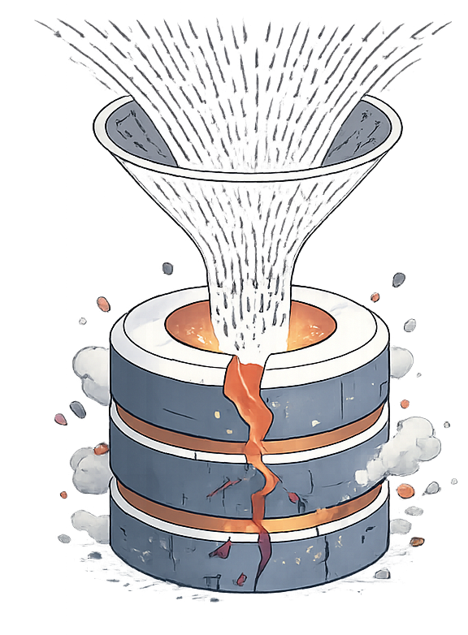

<div align="center">
  

  # TinerPay

  **Demo de sistema de pagos distribuido con CockroachDB y Node.js**

  
  
  
  
</div>

---

## ¿Qué es TinerPay?

TinerPay es una **simulación interactiva de una plataforma fintech** que demuestra cómo funciona una app de pagos digitales respaldada por una base de datos distribuida real. El proyecto pone en marcha un **cluster de 3 nodos CockroachDB** localmente y expone una API REST que alimenta un frontend web completo.

<div align="center">
  
  <p><em>TinerPay responde al problema de los sistemas de pago centralizados: un único punto de fallo.</em></p>
</div>

---

## Características principales

| Característica | Detalle |
|---|---|
| **Cluster distribuido** | 3 nodos CockroachDB en local (puertos 26257, 26258, 26259) |
| **API REST** | Express.js con endpoints CRUD para usuarios, wallets y transacciones |
| **Transacciones ACID** | Transferencias atómicas con `BEGIN / COMMIT / ROLLBACK` |
| **Alta disponibilidad** | El sistema sigue funcionando si un nodo cae |
| **Soft delete** | Los usuarios se borran lógicamente (`deleted_at`) |
| **Multi-currency** | Soporte EUR y USD desde el schema |

---

## Arquitectura

<div align="center">
  
</div>

### Stack tecnológico

```
Frontend  ──►  HTML / CSS / JavaScript (vanilla)
                        │
                        ▼
Backend   ──►  Node.js + Express  (puerto 3000)
                        │
                        ▼
Base de datos ──► CockroachDB cluster (3 nodos locales)
                   ├── node1 :26257
                   ├── node2 :26258
                   └── node3 :26259
```

### Modelo de datos

```sql
currencies   (code PK, name, symbol)
     │
     │
wallets  ──── users  (id UUID, name, email, deleted_at)
  │
  ├── from_wallet ──► transactions (id UUID, amount, created_at)
  └── to_wallet   ──►
```

<div align="center">
  
</div>

---

## Requisitos

- [CockroachDB](https://www.cockroachlabs.com/docs/stable/install-cockroachdb-mac.html) — `brew install cockroachdb/tap/cockroach`
- [Node.js](https://nodejs.org/) v18+ — `brew install node`

---

## Instalación y uso

```bash
# Clonar el repositorio
git clone https://github.com/diegoalegil/TinerPay.git
cd TinerPay

# Arrancar todo (cluster CockroachDB + servidor Node.js)
./start.sh
```

Abre `http://localhost:3000` en el navegador.

```bash
# Detener todo
./stop.sh

# Reiniciar la base de datos (borra todos los datos)
./reset.sh
```

> El script `start.sh` instala las dependencias npm automáticamente si no existen, arranca los 3 nodos del cluster, inicializa el schema y levanta el servidor.

---

## API REST

| Método | Endpoint | Descripción |
|---|---|---|
| `GET` | `/api/users` | Listar usuarios con saldo |
| `POST` | `/api/users` | Crear usuario + wallet EUR |
| `DELETE` | `/api/users/:id` | Borrado lógico de usuario |
| `GET` | `/api/wallets` | Listar wallets |
| `POST` | `/api/deposit` | Depositar fondos |
| `POST` | `/api/transfer` | Transferir entre wallets |
| `GET` | `/api/transactions` | Historial de transacciones |
| `GET` | `/api/cluster` | Estado del cluster |
| `POST` | `/api/cluster/reset` | Reiniciar cluster |

---

## Propiedades del sistema

<div align="center">
  <table>
    <tr>
      <td align="center"><br/><b>Escalabilidad horizontal</b></td>
      <td align="center"><br/><b>Multi-región</b></td>
    </tr>
  </table>
</div>

- **Tolerancia a fallos:** si un nodo cae, el cluster sigue operativo con los dos restantes.
- **Consistencia:** todas las transacciones son ACID — nunca se pierde dinero a mitad de una transferencia.
- **Escalabilidad:** CockroachDB escala horizontalmente añadiendo nodos sin downtime.

---

## Estructura del proyecto

```
TinerPay/
├── index.html          # Frontend principal
├── start.sh            # Arrancar cluster + servidor
├── stop.sh             # Parar todo
├── reset.sh            # Reiniciar base de datos
├── server/
│   ├── index.js        # Servidor Express + rutas API
│   ├── db.js           # Pool de conexiones CockroachDB
│   ├── cluster.js      # Gestión del cluster (arranque/parada de nodos)
│   └── init.js         # Schema y datos semilla
├── sections/           # Estilos CSS por sección
├── components/         # Componentes CSS reutilizables
└── img/                # Assets e imágenes
```

---

<div align="center">
  

  *TinerPay — Proyecto de demostración de sistemas de pagos distribuidos*
</div>
